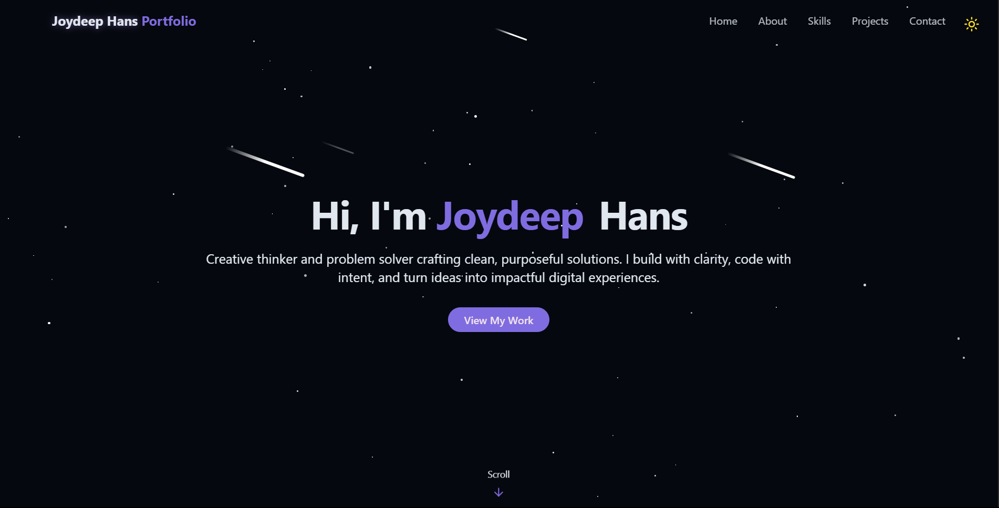

# Joydeep Hans - Portfolio Website

 <!-- Add a screenshot if available -->

## 🌟 About My Portfolio

Welcome to my personal portfolio website! This is a showcase of my skills, projects, and professional journey as a developer. The site features a modern, interactive design with smooth animations and a clean UI.

## 🚀 Features

- **Responsive Design**: Works flawlessly on all devices
- **Dark/Light Mode**: Theme toggle with system preference detection
- **Interactive Elements**: Smooth animations and hover effects
- **Project Showcase**: Highlighting my best work
- **Contact Integration**: Easy way to get in touch
- **Performance Optimized**: Fast loading and smooth scrolling

## 🛠️ Technologies Used

- **Frontend**: 
  - React.js
  - Tailwind CSS
  - TypeScript
  - Framer Motion (for animations)
  - Lucide Icons

- **Deployment**:
  - Vercel (or your hosting platform)

## 📌 Sections

1. **Hero Section** - Introduction with animated text
2. **About Me** - Professional background and skills
3. **Projects** - Featured work with descriptions
4. **Contact** - Easy way to reach out

## 🎨 Design Highlights

- Custom animated star background
- Theme-aware components (light/dark mode)
- Smooth scroll navigation
- Responsive typography and spacing
- Attention to accessibility standards

## 🏗️ Project Structure
src/
├── components/
│ ├── HeroSection.jsx # Animated introduction
│ ├── Navbar.jsx # Navigation header
│ ├── ProjectSection.jsx # Showcase of work
│ └── ... # Other components
├── styles/ # Global styles
└── App.jsx # Main application

## 🌐 Live Demo

Check out the live version at: [your-portfolio-url.com](https://your-portfolio-url.com)

## 🤝 Contact Me

Feel free to reach out for collaborations or just to say hello!

- Email: [hansjoydeep@gmail.com](mailto:hansjoydeep@gmail.com)
- LinkedIn: [linkedin.com/in/joydeep-hans-65870928a/](https://www.linkedin.com/in/joydeep-hans-65870928a/)
- GitHub: [github.com/JOY23072005](https://github.com/JOY23072005)

---

✨ Crafted with passion by Joydeep Hans